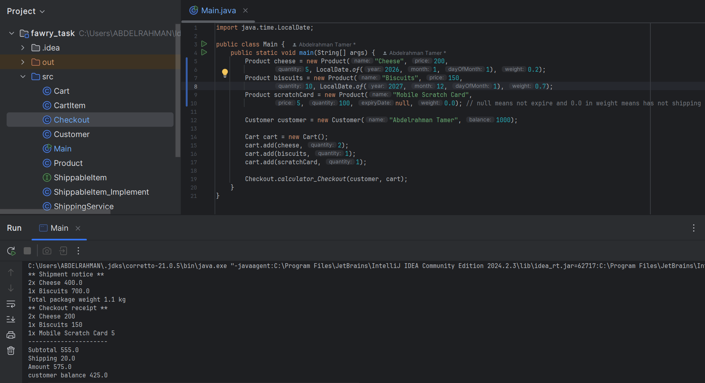
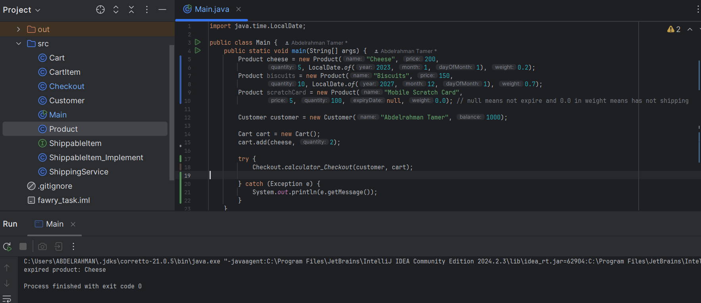
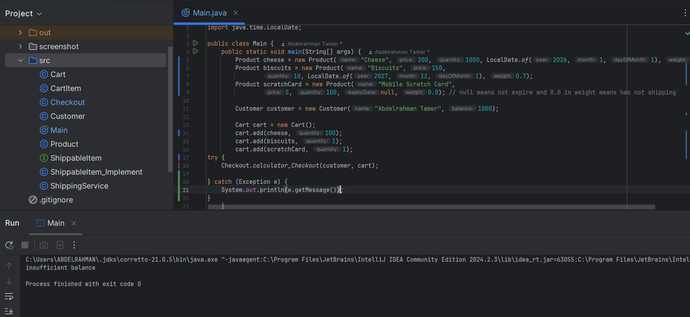
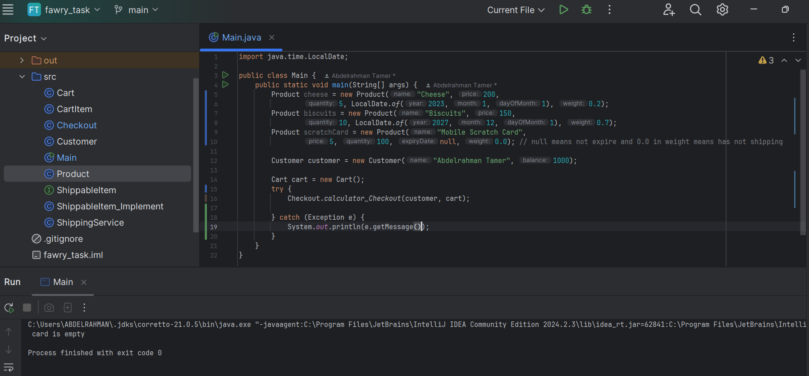
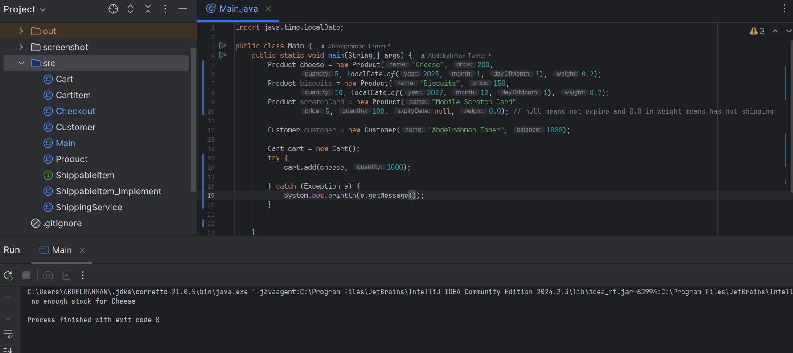

#  Java Shopping Cart & Checkout System

This project demonstrates an object-oriented approach to building a **shopping cart and checkout system** in Java. It handles adding products to a cart, checking product availability, processing a checkout, calculating shipping costs, and notifying the shipping service.

---

##  Project Structure

###  `Product`
- Represents an item in the store.
- Includes fields like:
  - `name`, `price`, `quantity`, `expiryDate`, and `weight`
- Key methods:
  - `is_Expired()`: Checks if the product is expired
  - `is_shipped()`: Returns `true` if the product has a weight (indicating it should be shipped)

---

###  `Cart`
- Maintains a list of `CartItem`s.
- Key method:
  - `add(Product product, int quantity)`: Adds a product to the cart; merges with existing item if already added
  - Automatically prevents adding items beyond available stock

---

###  `CartItem`
- Represents a product and the quantity added to the cart.

---

###  `Checkout`
- Handles the purchase process and business logic:
  - Validates product availability and expiration
  - Deducts quantities from inventory
  - Charges the customer
  - Calculates subtotal, shipping, and total
  - Notifies shipping service for shippable products
  - Displays a receipt

---

###  `ShippableItem` & `ShippableItem_Implement`
- Interface and implementation for representing items eligible for shipping.

---

###  `ShippingService`
- Displays a shipping notice:
  - Lists all items being shipped with weight
  - Calculates total weight of the package

---

### Exception Handling
- The system throws exceptions when:
  - Trying to check out with an empty cart
  - Trying to buy an expired product
  - Trying to purchase more than available stock
- If the customer's balance is insufficient, the exception is thrown then return product quantity 

---

##  Example Output

###  Screenshot 1 – Adding , Buying Products , Shipping and Checkout Receipt

###  Screenshot 2 – User buy Expired Product

##  Screenshot 3 – insufficient balance

##  Screenshot 4 – Empty cart

##  Screenshot 4 – no enough stock for this product

